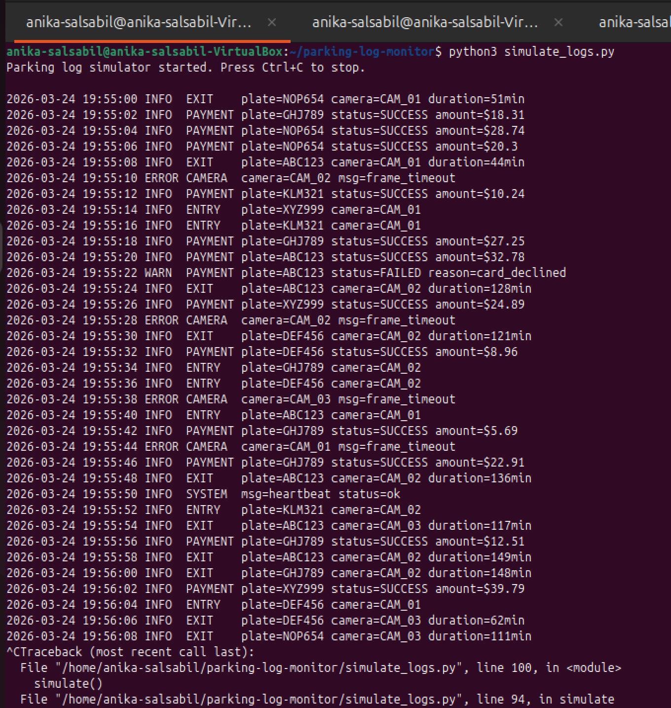
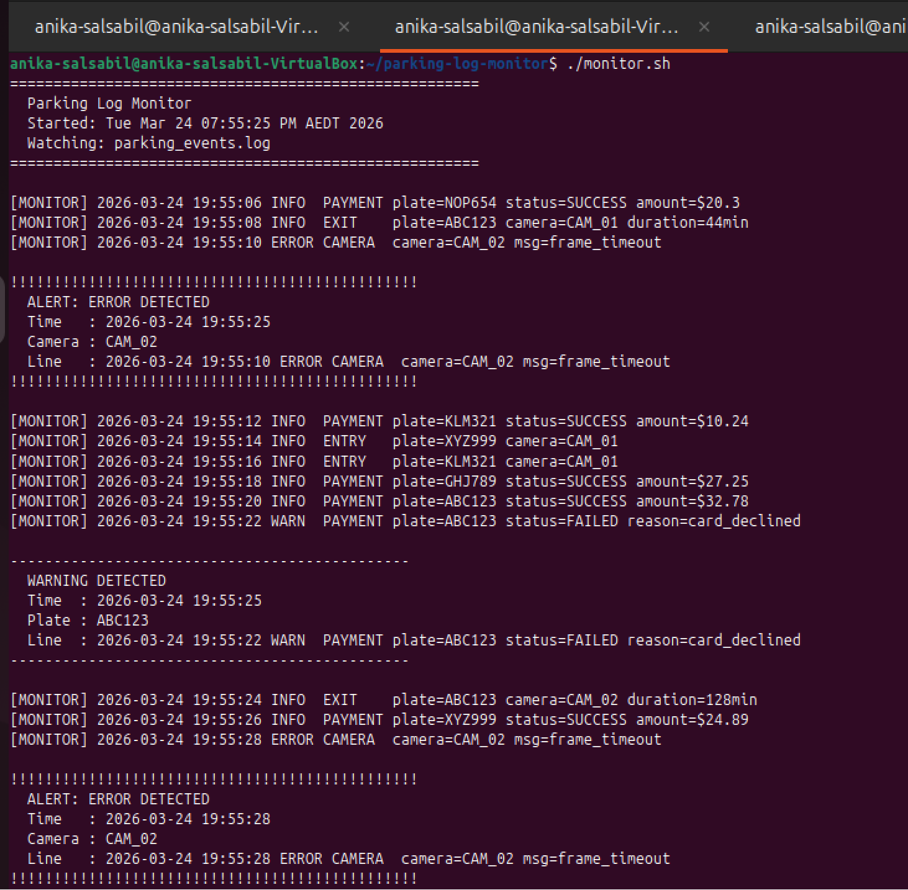
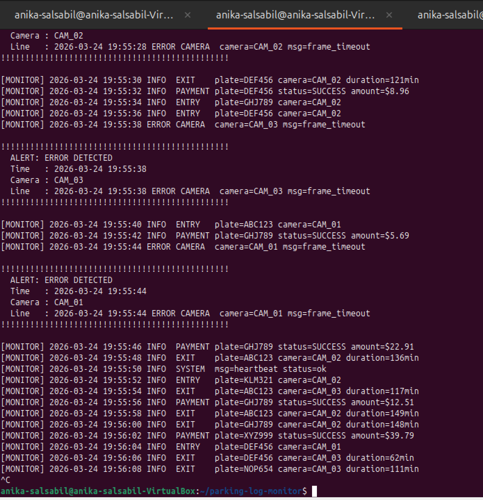
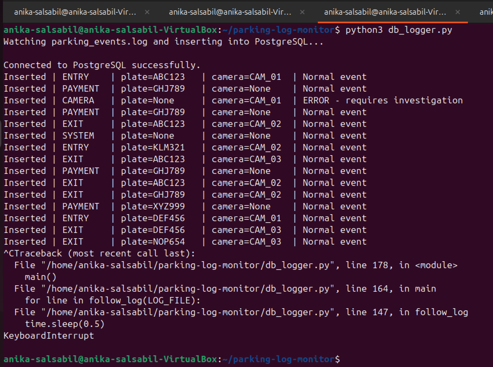
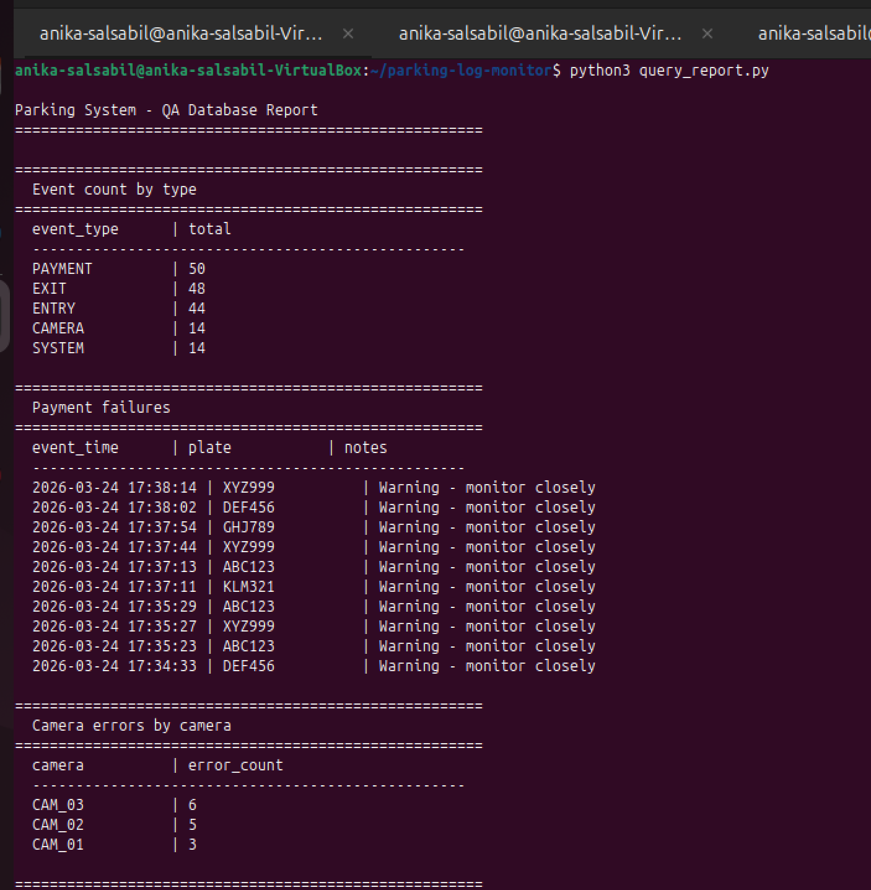
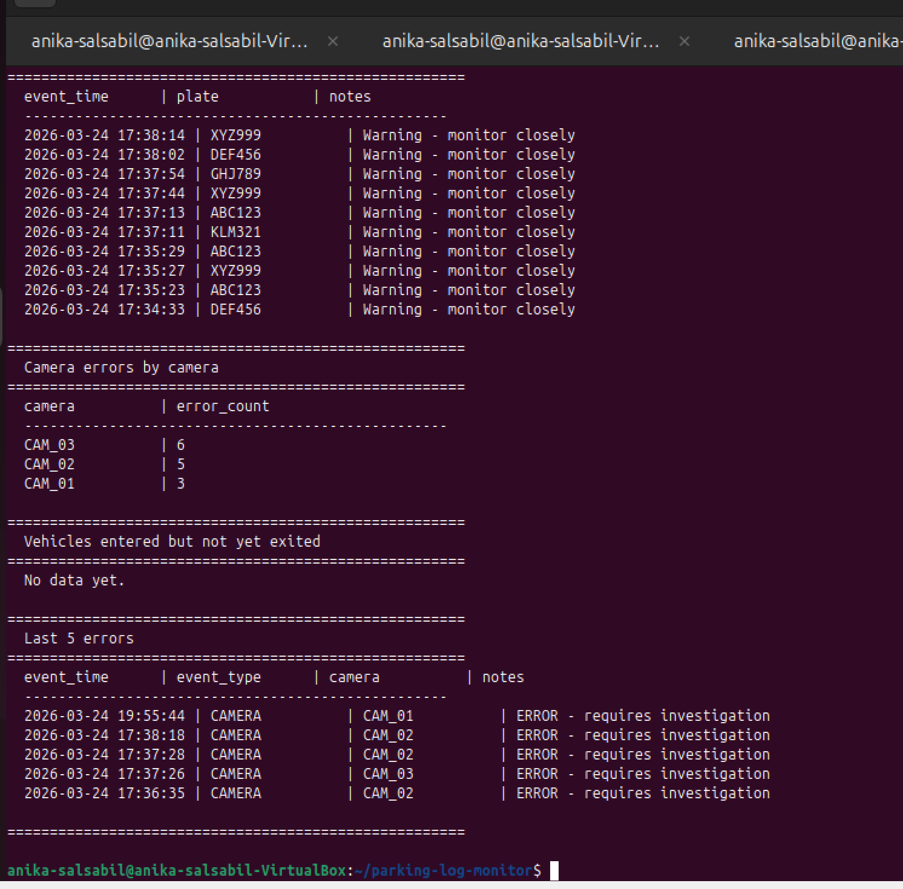

# Parking Log Monitor

A Linux-based log monitoring and analysis tool built to simulate
and monitor a parking access control system.

Built as a hands-on learning project to demonstrate the Linux shell
scripting, Python, and PostgreSQL skills in a context relevant
to smart parking systems.

## What It Does

- Simulates real-time parking events (vehicle entry/exit,
  payments, camera errors) via Python
- Monitors the live log in real time using bash shell scripting
  (tail -f, grep, awk) and alerts on errors and warnings
- Parses and stores every event as structured data in PostgreSQL
- Generates QA analysis reports via SQL queries - payment
  failure rates, camera fault frequency, and vehicles still parked

## Tech Stack

- Linux (Ubuntu 22.04)
- Bash shell scripting
- Python 3
- PostgreSQL
- Git

## Project Structure

- simulate_logs.py  - generates fake parking system log events
- monitor.sh        - shell script: watches log, alerts on errors
- check_alerts.sh   - shell summary: counts errors by type/camera
- db_logger.py      - parses log lines and inserts into PostgreSQL
- query_report.py   - SQL-based QA report from the database

## How to Run

1. Start PostgreSQL:
  sudo service postgresql start

2. Terminal 1 - run the simulator:
  python3 simulate_logs.py

3. Terminal 2 - run the shell monitor:
  ./monitor.sh

4. Terminal 3 - run the database logger:
  python3 db_logger.py

5. Terminal 4 - generate the QA report:
  python3 query_report.py

## Screenshots

### Live log simulator + shell monitor running together

### Database logger inserting events into PostgreSQL

### QA analysis report

## Key SQL Queries

-- Events by type
SELECT event_type, COUNT(*) FROM parking_events GROUP BY event_type;

-- Payment failures
SELECT event_time, plate FROM parking_events WHERE status = 'FAILED';

-- Camera faults ranked
SELECT camera, COUNT(*) AS errors FROM parking_events
WHERE notes LIKE 'ERROR%' GROUP BY camera ORDER BY errors DESC;

-- Vehicles still parked
SELECT plate FROM parking_events WHERE event_type = 'ENTRY'
AND plate NOT IN (SELECT plate FROM parking_events WHERE event_type = 'EXIT');

